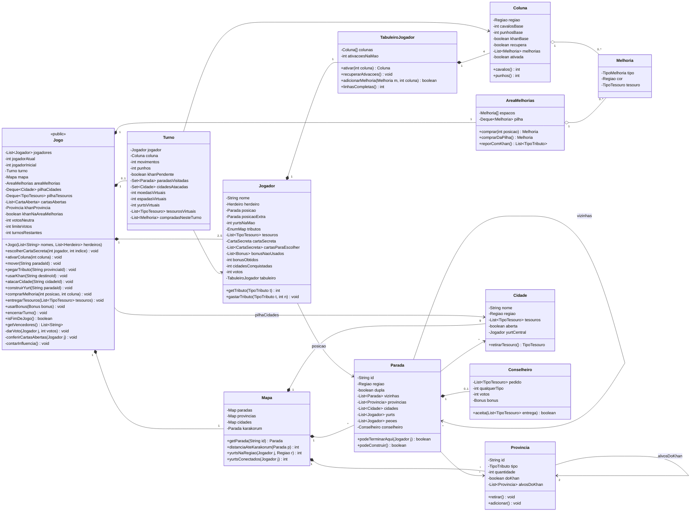
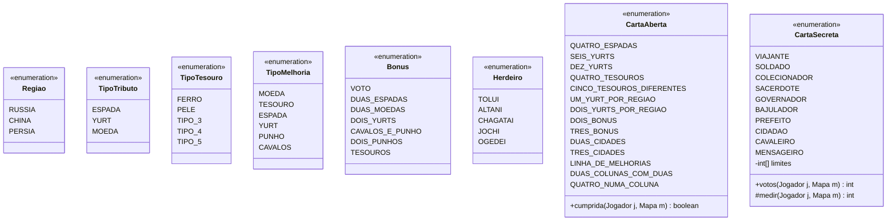

# Diagrama de classes

This diagram follows the rules in [rules.md](rules.md). Section numbers such as "§8.1" point to that file.

All classes are in the `model` package. `Jogo` is the only `public` class. The other classes are package-private. The GUI and the tests call only `Jogo`, and they send ids (`String`) and indexes (`int`), not model objects.

## Classes



## Enums

The rules give a fixed list of each of these things, so each one is an `enum`. The cards and the heirs have different rules, so each constant overrides one method.



## Design decisions

### Map: a graph with adjacency lists

- The map is a graph. Each `Parada` is a node, and each route is an edge in the list `vizinhas`.
- A double stop is one `Parada` with `dupla = true`. Thus, going through it costs 1 move (§7.1).
- Karakorum is a `Parada` with `regiao = null`. It holds all pawns and no yurts.
- Each `Parada` also keeps lists of its adjacent `Provincia` and `Cidade` objects. The game uses them for "take tribute" (§7.2), "attack a city" (§8.1), and the secret cards Prefeito, Cidadão, and Bajulador.
- `Mapa` keeps each kind of object in a `Map<String, T>`, with the id as the key. The GUI and the tests use these ids.
- `distanciaAteKarakorum` and `yurtsConectados` are breadth-first searches on the graph. They serve the tie-break rule (§14.3) and the Viajante card.
- There is no graph library. Adjacency lists are enough for a map of this size.

Put the map data in one text file, for example `src/main/resources/mapa.txt`. `Mapa` reads it at startup. The rulebook shows the map only as a picture, so the group must copy the data from the main board.

```text
# stops: id region double
PARADA kiev1 RUSSIA false
# edges between stops
ROTA kiev1 moscou2
# province: id tribute-type khan
PROVINCIA p7 MOEDA true
# which provinces a stop touches
TOCA kiev1 p7
```

### Game pieces: counters, not objects

- Tribute pieces are interchangeable, so `Jogador.tributos` is an `EnumMap<TipoTributo, Integer>`. `Provincia.quantidade` is an `int`, because each province has one printed tribute type.
- Treasures are lists of `TipoTesouro`, because the deliveries need the type of each treasure.
- Yurts on the map are references to the owner (`Parada.yurts`, `Cidade.yurtCentral`). `Jogador.yurtsNaMao` counts the yurts that the player did not build.

### Turn state in `Turno`

Many rules depend on what happened in the current turn. `Jogo` makes a new `Turno` in `ativarColuna`. It removes the `Turno` in `encerrarTurno`.

- `paradasVisitadas`: "take tribute" (§7.2), "attack a city" (§8.1), and "build yurts" (§8.2) check this set. A stop skipped with a yurt is not in the set.
- `cidadesAtacadas`: the first treasure costs 1 sword. The next treasures from the same city cost 2 (§8.1).
- `moedasVirtuais`, `espadasVirtuais`, `yurtsVirtuais`, `tesourosVirtuais`: the upgrades of the activated column give these for this turn only (§9).
- `compradasNesteTurno`: an upgrade does not work in the turn that you buy it (§8.3).
- `khanPendente`: `encerrarTurno` fails if the column has a Khan and the player did not use it (§7.3).

### Heirs: one `enum`, checks in the rules

`Herdeiro` is an enum. Each rule method in `Jogo` or `Parada` checks the heir where the ability changes the rule. For example, `construirYurt` accepts an adjacent stop for `TOLUI`. There are 5 heirs, and each one changes one or two rules. Thus, one class for each heir is not necessary.

`Jogador.posicaoExtra` is the second pawn of Altani. It is `null` for all other heirs.

### End of the game

- `darVoto` moves the player token and the neutral token (§8.6). When `votosNeutra` reaches `limiteVotos` (10, 14, 16, or 17), `Jogo` sets `turnosRestantes` (§14).
- `contarInfluencia` uses the table in §14.1. It reads `Mapa.yurtsNaRegiao` and the number of upgrades in the `Coluna` of each region. The white column has `regiao = null`, so it never counts.
- `CartaSecreta.votos` compares the value from `medir` with the 3 numbers in `limites` (§13). For example, `SOLDADO` has `limites = {4, 7, 10}`.

## Items to confirm with the group

These items come from the **[unclear]** marks in `rules.md`. Each one can change the diagram.

- The names of treasure types 3 to 5 (`TipoTesouro`).
- The base actions and the region color of each column (`Coluna` fields).
- The full ability of each heir (`Herdeiro`).
- Where delivered treasures go. This diagram assumes that `entregarTesouros` puts them back in `pilhaTesouros`.
- The positions of the coin and sword icons in the upgrade area (`AreaMelhorias.reporComKhan`).
